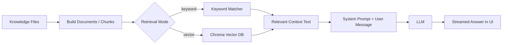
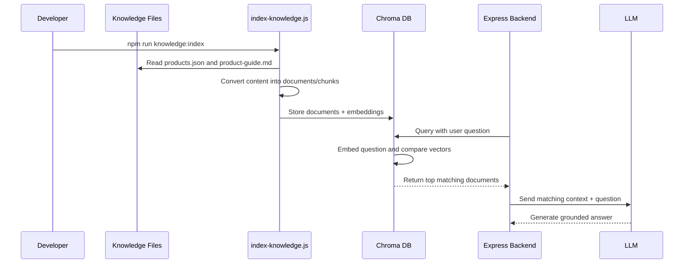
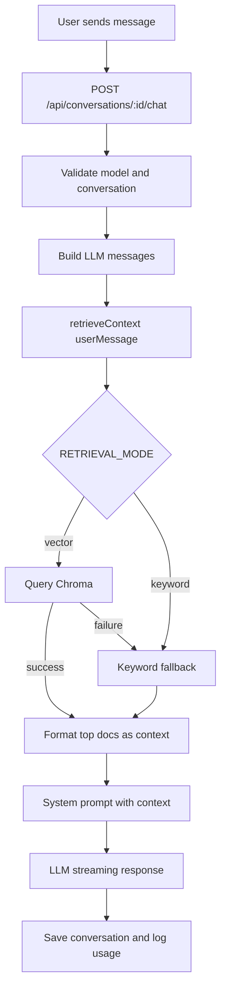

# Retrieval and Vector Database Deep Dive

This document explains how the Employee Chatbot finds relevant knowledge before calling the LLM. It covers both retrieval systems in the app:

- Legacy keyword retrieval
- Vector retrieval with Chroma

The short version: the chatbot does not expect the LLM to magically know our internal products and policies. Before each answer, the backend retrieves a small packet of relevant context from the local knowledge base and places that context into the LLM prompt.

## Why Retrieval Exists

LLMs are good at language, but they are not reliable databases. If we ask:

```text
Which product supports SCORM?
```

the LLM may not know our internal catalog. So we first retrieve relevant knowledge from:

```text
knowledge/products.json
knowledge/product-guide.md
```

Then we send the LLM a prompt like:

```text
You are an internal employee assistant.
Answer only using this context.

--- CONTEXT ---
[LearnLoop LMS]
Product: LearnLoop LMS
SKU: LLM-012
...
Specs: scormSupport: true

--- USER QUESTION ---
Which product supports SCORM?
```

The LLM’s job becomes much safer: read the supplied context and produce a helpful answer.

## The Big Picture



The app chooses retrieval mode using:

```env
RETRIEVAL_MODE=vector
```

or:

```env
RETRIEVAL_MODE=keyword
```

If vector mode fails because Chroma is offline or the collection is unavailable, the app falls back to keyword retrieval.

## Analogy: Librarian vs. Index Cards

Think of the knowledge base as a company library.

### Keyword retrieval is like exact index cards

If you ask for `SCORM`, the librarian looks for cards that literally contain `SCORM`.

That works well when your question uses the same words as the document.

But if you ask:

```text
Which training platform supports imported e-learning packages?
```

the keyword system may struggle because the words `SCORM` and `e-learning packages` are related but not identical.

### Vector retrieval is like a librarian who understands meaning

Vector retrieval converts both documents and questions into numeric “meaning maps.” Then it finds documents whose meanings are close to the question.

So even if the wording differs, Chroma can still find the right document.

For example:

```text
field staff offline mobile forms
```

can match:

```text
FieldTrack Mobile supports offline forms, GPS check-ins, and photo uploads.
```

even though the query is not an exact sentence from the product file.

## Important: Embeddings Are Not Decryption

Embeddings can sound mysterious, but they are not encryption and they are not decrypted later.

An embedding is a list of numbers that represents the meaning of text.

Example conceptually:

```text
"LearnLoop LMS supports SCORM packages"
        ↓
[0.12, -0.44, 0.03, 0.91, ...]
```

Those numbers are useful for comparing meaning, not for reconstructing the original text.

So the process is:

```text
Text → Embedding vector → Similarity search
```

not:

```text
Text → Encrypted text → Decrypted text
```

Chroma still stores the original document text too. The vector is used to find relevant rows; the original text is what gets passed to the LLM.

## Vector Retrieval Flow in This App



## Step 1: Knowledge Files Become Documents

The source files are:

```text
knowledge/products.json
knowledge/product-guide.md
```

The shared document builder lives in:

```text
server/services/knowledgeDocuments.js
```

Each product becomes one document:

```text
Product: LearnLoop LMS
SKU: LLM-012
Price: $24.99/month
Category: Learning Management
Specs: activeLearners: 1000, courses: Unlimited, certificates: Included, scormSupport: true
Support: Supports course assignments, progress tracking, quizzes, completion certificates, and SCORM packages.
```

Each Markdown guide section also becomes one document:

```text
[Return and Refund Policy]
All SaaS subscriptions can be cancelled within 14 days...
```

Each document gets:

- `id`
- `source`
- `content`
- `metadata`

Example IDs:

```text
product:LLM-012
guide:return-and-refund-policy
```

## Step 2: Documents Are Indexed into Chroma

Run:

```bash
npm run chroma:start
```

Then:

```bash
npm run knowledge:index
```

The indexer:

1. Reads local knowledge files.
2. Builds documents.
3. Rebuilds the Chroma collection.
4. Stores document text and metadata.
5. Lets Chroma generate default local embeddings.

The configured collection is:

```env
CHROMA_COLLECTION=employee_knowledge
```

By default, Chroma runs at:

```env
CHROMA_URL=http://localhost:8000
```

## Step 3: User Question Becomes a Query

When the user asks:

```text
Which product supports SCORM?
```

the backend calls:

```text
server/services/retrieval.js
```

If `RETRIEVAL_MODE=vector`, the adapter calls:

```text
server/services/vectorKnowledge.js
```

That service sends the question to Chroma:

```js
collection.query({
  queryTexts: [query],
  nResults: VECTOR_TOP_K,
  include: ["documents", "metadatas", "distances"],
});
```

Chroma embeds the question, compares it against stored document embeddings, and returns the closest matches.

## Step 4: Chroma Returns Similar Documents

For:

```text
Which product supports SCORM?
```

the top result should be:

```text
LearnLoop LMS
```

The test command shows this directly:

```bash
npm run knowledge:test
```

Example output:

```text
QUERY: which product supports SCORM
1. LearnLoop LMS | distance=0.5537993 | Product: LearnLoop LMS ...
```

Lower distance generally means “closer match.”

## Step 5: Relevant Context Is Passed to the LLM

The vector retriever returns plain context text in the same format as the old keyword retriever:

```text
[LearnLoop LMS]
Product: LearnLoop LMS
SKU: LLM-012
...
```

Then `server/services/openai.js` inserts that context into the system prompt:

```text
--- CONTEXT ---
[LearnLoop LMS]
...
```

The prompt also says:

```text
Answer ONLY using the provided context.
If the answer is not in the context, say you don't have that information.
```

That is what keeps answers grounded in the retrieved knowledge.

## Runtime Flow in the Chat API



## Fallback Behavior

Fallback is intentional.

If Chroma is not running, the app logs something like:

```text
[retrieval] Vector retrieval failed; falling back to keyword retrieval.
mode=vector chromaUrl=http://localhost:8000 collection=employee_knowledge error=...
```

Then it uses the legacy keyword retriever.

This means the chatbot can still answer many questions even when Chroma is temporarily unavailable.

## Health Check Commands

Use this command to confirm Chroma is reachable and indexed:

```bash
npm run knowledge:health
```

Healthy output should show:

```text
chromaReachable: true
collections: [ 'employee_knowledge' ]
count: 22
indexed: true
```

If Chroma is running but `count` is `0`, run:

```bash
npm run knowledge:index
```

If Chroma is not reachable, start it:

```bash
npm run chroma:start
```

## Keyword Retrieval vs. Vector Retrieval

| Area | Keyword Retrieval | Vector Retrieval with Chroma |
| --- | --- | --- |
| Main idea | Match query words against document words | Match meaning using embeddings |
| Best for | Exact names, SKUs, obvious terms | Natural language, synonyms, fuzzy questions |
| Example strength | `TFB-003` finds TeamFlow Basic | `field staff offline forms` finds FieldTrack Mobile |
| Setup | No external service | Requires Chroma running and indexed |
| Speed | Very fast for small files | Fast, but involves Chroma query and embeddings |
| Code complexity | Can become messy as matching rules grow | Cleaner retrieval logic, more infrastructure |
| Failure mode | Poor match if wording differs | Falls back if Chroma is offline |
| Update workflow | Restart backend after file changes | Re-run `npm run knowledge:index` after file changes |
| Scalability | Fine for small/simple knowledge | Better for larger knowledge bases |
| Explainability | Easy to inspect keyword matches | Similarity scores are less intuitive |

## Advantages and Disadvantages

### Keyword Retrieval

Advantages:

- Simple to run.
- No vector database required.
- Easy to debug.
- Works well for exact product names, SKUs, and obvious words.
- Good fallback when Chroma is down.

Disadvantages:

- Gets harder to maintain as rules grow.
- Can miss relevant context when wording changes.
- Often needs manual special cases.
- May return irrelevant chunks if common words overlap.
- Not ideal for larger knowledge bases.

### Vector Retrieval

Advantages:

- Better semantic matching.
- Handles synonyms and natural questions better.
- Keeps retrieval code cleaner.
- Scales better as knowledge grows.
- Separates document preparation, indexing, and querying.

Disadvantages:

- Requires Chroma to be running.
- Requires indexing after knowledge changes.
- Similarity distance is less obvious than keyword hits.
- First-time setup is heavier.
- Local embedding model behavior can differ from hosted embedding providers.

## Practical Rules for This Project

Use vector mode for normal development:

```env
RETRIEVAL_MODE=vector
```

Use keyword mode if you want the simplest no-Chroma setup:

```env
RETRIEVAL_MODE=keyword
```

After changing `knowledge/products.json` or `knowledge/product-guide.md`, run:

```bash
npm run knowledge:index
```

Before debugging chat quality, run:

```bash
npm run knowledge:health
npm run knowledge:test
```

If `knowledge:test` returns the right documents but the LLM answer is bad, the problem is probably prompt/model behavior.

If `knowledge:test` returns the wrong documents, the problem is retrieval/indexing.

That separation is the main benefit of having a clean retrieval layer.

